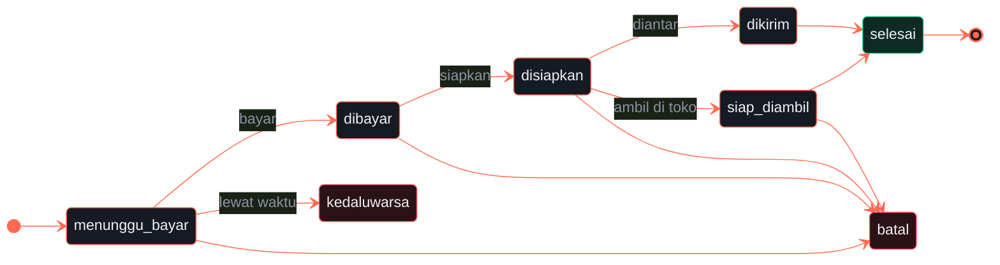

<a name="top"></a>

<div align="center">


<br />


<br /><br />

**Aplikasi kasir (POS) untuk toko retail kecil–menengah.**<br />
Transaksi cepat dengan scan barcode, manajemen stok &amp; harga modal,<br />
pencatatan pengeluaran, serta laporan pemasukan vs pengeluaran per periode.

<br />

[**Prinsip**](#prinsip) &nbsp;·&nbsp;
[**Mulai**](#mulai) &nbsp;·&nbsp;
[**Fitur**](#fitur) &nbsp;·&nbsp;
[**QRIS**](#qris) &nbsp;·&nbsp;
[**Struktur**](#struktur) &nbsp;·&nbsp;
[**Skema**](#skema) &nbsp;·&nbsp;
[**Testing**](#testing) &nbsp;·&nbsp;
[**Deploy**](#deploy) &nbsp;·&nbsp;
[**Roadmap**](#roadmap)

</div>

<br />

<table>
  <tr>
    <td align="center" width="25%"><h3>0</h3><sub>harga yang diambil<br />dari browser</sub></td>
    <td align="center" width="25%"><h3>12 → 10</h3><sub>checkout serentak,<br />stok tidak pernah minus</sub></td>
    <td align="center" width="25%"><h3>3 mode</h3><sub>QRIS — dan tak satu pun<br />memalsukan kode QR</sub></td>
    <td align="center" width="25%"><h3>2 pintu</h3><sub>kasir &amp; etalase publik,<br />satu sumber stok</sub></td>
  </tr>
</table>


<a name="prinsip"></a>

## 01 &nbsp;·&nbsp; Prinsip utama: browser tidak dipercaya

Ini keputusan arsitektur terpenting di proyek ini, dan mempengaruhi hampir semua kode di bawah.

> [!IMPORTANT]
> Harga, total, diskon, dan stok **tidak pernah** diambil dari data yang dikirim browser.
> Browser hanya boleh mengirim `productId` dan `qty`.


Kasir mengirim daftar barang, lalu **server** membaca harga dari Firestore, menghitung ulang totalnya,
memeriksa stok, dan mengurangi stok — semuanya di dalam satu Firestore transaction. Firestore Security
Rules menolak semua penulisan langsung dari browser ke koleksi `products`, `transactions`, `expenses`,
dan `auditLogs`.

Akibat praktisnya:

- Kasir yang membuka DevTools dan mengubah harga di layar **tetap ditagih harga sebenarnya**.
- Dua kasir yang checkout barang terakhir secara bersamaan **tidak bisa membuat stok menjadi minus**.

<div align="right"><sub><a href="#top">↑ kembali ke atas</a></sub></div>


<a name="mulai"></a>

## 02 &nbsp;·&nbsp; Mulai cepat

```bash
npm install
npm run dev
```

**Dua pintu, satu server:**

| Alamat | Untuk siapa |
|:--|:--|
| `http://localhost:3000/` | **Kasir &amp; admin toko** — butuh login staf |
| `http://localhost:3000/toko.html` | **Pembeli** — etalase publik, bisa dibuka tanpa akun |

Keduanya berbagi satu sumber stok. Barang yang direstock admin langsung muncul di etalase, dan barang
yang dipesan pembeli langsung hilang dari daftar jual kasir.

<table>
  <tr>
    <td width="50%" valign="top">
      <h3>Mode Demo</h3>
      <sub>TANPA FIREBASE · SIAP DICOBA</sub>
      <p>Klik <b>"Demo tanpa login"</b>. Aplikasi berjalan penuh dengan data di <code>localStorage</code>
      browser — cocok untuk mencoba alur kasir, scan barcode, dan laporan tanpa menyiapkan apa pun.</p>
      <p>Mode demo memakai aturan validasi yang <b>sama</b> dengan server (harga dibaca dari data
      tersimpan, stok dicek sebelum dikurangi), jadi perilakunya tidak menyesatkan. Datanya memakai
      prefiks <code>kasirone_demo_</code> dan tidak pernah bercampur dengan data Firestore.</p>
    </td>
    <td width="50%" valign="top">
      <h3>Mode Produksi</h3>
      <sub>FIREBASE AUTH · CLOUD FIRESTORE</sub>
      <p>Login staf sungguhan, data di Firestore, role dibaca dari custom claim, dan setiap
      penulisan melewati server serta Security Rules.</p>
      <p>Butuh sekitar delapan langkah penyiapan sekali jalan — lihat panduan di bawah.</p>
    </td>
  </tr>
</table>

<details>
<summary><b>Panduan penyiapan Mode Produksi</b></summary>

<br />

1. Buat project di [Firebase Console](https://console.firebase.google.com).
2. Daftarkan Web App, salin konfigurasinya ke `public/firebase-config.js`.
3. Aktifkan **Authentication → Email/Password**.
4. Buat **Cloud Firestore**.
5. Deploy security rules: `npx firebase deploy --only firestore:rules`
6. Unduh service account (*Project Settings → Service accounts*) dan simpan sebagai
   `serviceAccountKey.json` di root project.
7. Salin `.env.example` menjadi `.env`.
8. Buat akun kasir lewat Firebase Authentication, lalu buat dokumen `users/{UID}`:

   ```json
   { "role": "cashier", "displayName": "Nabila" }
   ```

   Atau lebih praktis, pakai skrip bawaan yang sekaligus memasang custom claim:

   ```bash
   node scripts/set-role.js kasir@toko.com cashier "Nabila"
   node scripts/set-role.js bos@toko.com  admin    "Admin Toko"
   ```

> [!TIP]
> Setelah role diubah, pengguna harus **logout lalu login lagi** agar token barunya terpakai.
> Lupa melakukan ini adalah penyebab paling umum error 403 yang muncul "tiba-tiba".

> [!CAUTION]
> `serviceAccountKey.json` **tidak boleh** masuk ke Git — sudah tercantum di `.gitignore`.
> Firebase Web API key di `firebase-config.js` bukan rahasia dan aman berada di frontend.

</details>

### Role

| Role | Bisa |
|:--|:--|
| `cashier` | Transaksi, scan barcode, lihat produk &amp; riwayat transaksi |
| `admin` | Semua di atas **+** kelola produk, restock, pengeluaran, laporan laba |

Role dibaca dari custom claim pada ID token; bila belum ada, sistem membaca dokumen `users/{uid}`
sebagai cadangan agar akun lama tetap bisa masuk.

<div align="right"><sub><a href="#top">↑ kembali ke atas</a></sub></div>


<a name="fitur"></a>

## 03 &nbsp;·&nbsp; Fitur


<details>
<summary><b>Daftar fitur lengkap</b></summary>

<br />

| Fitur | Keterangan |
|:--|:--|
| **Scan barcode** | Mendukung scanner USB (mode *keyboard wedge*: mengetik cepat lalu Enter) tanpa driver apa pun. Barcode yang tidak terdaftar memunculkan notifikasi, bukan gagal diam-diam. |
| **Transaksi atomik** | Stok dan transaksi tersimpan bersama atau tidak sama sekali. Sudah diuji dengan 12 checkout serentak. |
| **Pembayaran** | Tunai (dengan kembalian), Kartu (kode approval EDC), dan QRIS. Sistem tidak pernah memalsukan kode QR — lihat [bagian QRIS](#qris). |
| **Diskon per transaksi** | Dipotong sebelum pajak. |
| **Foto produk asli** | Bisa diunggah (klik atau seret), dikecilkan otomatis di browser sebelum disimpan. |
| **Ekspor CSV** | Untuk riwayat transaksi dan laporan. |
| **Harga modal &amp; margin** | Per produk, jadi laba bisa dihitung. |
| **Stok minimum per produk** | Ambang "menipis" ditentukan per barang, bukan satu angka untuk semua. |
| **Restock satu aksi** | Menambah stok sekaligus mencatat pengeluarannya. |
| **Laporan periodik** | Pemasukan, pengeluaran, laba kotor &amp; bersih, rincian metode bayar, dan unit terjual per produk (mis. *Top Kopi Aren 40 pcs, Indomie Goreng 23 pcs*). |
| **Riwayat transaksi** | Filter tanggal dan struk yang bisa dicetak. |
| **Etalase publik** | `/toko.html` — katalog, keranjang, pilihan ambil di toko atau diantar, dan riwayat pesanan pembeli. |
| **Pesanan online** | Siklus status penuh; stok dikunci saat memesan, dilepas saat batal, dipotong saat selesai. |
| **Panel pesanan staf** | Saring status, lihat rincian, pindahkan tahap. |
| **Webhook pembayaran** | Bertanda tangan, agar status tidak bergantung pada peramban pembeli yang mungkin sudah ditutup. |

</details>

<a name="qris"></a>

### Soal kepercayaan pada pembayaran QRIS

Versi sebelumnya menampilkan pola kotak-kotak sebagai "QR demo". Itu berbahaya: kasir bisa mengira
pembayaran sungguhan sedang berlangsung. Sekarang ada tiga mode, dan halaman **Pengaturan** selalu
menyatakan mana yang aktif.

| Mode | Cara mengaktifkan | Uang benar-benar masuk? | Sistem bisa memastikan lunas? |
|:--|:--|:--:|:--|
| 🟢 **Terverifikasi** | isi `MIDTRANS_SERVER_KEY` | Ya | **Ya** — status dicek ke gateway |
| 🟡 **Manual** | isi `MERCHANT_QRIS_PAYLOAD` | Ya | Tidak — kasir cek mutasi |
| ⚪ **Nonaktif** | keduanya kosong | — | QRIS ditolak, bukan dipalsukan |

- Pada mode **Terverifikasi**, tombol konfirmasi menolak menyimpan transaksi sampai gateway menyatakan lunas.
- Pada mode **Manual**, nominal tidak terkunci sehingga aplikasi memperingatkan kasir untuk mengecek mutasi lebih dulu.
- Pada mode **Nonaktif** dan mode demo, tidak ada gambar QR yang ditampilkan sama sekali.

> [!NOTE]
> Mulailah dari sandbox Midtrans (`MIDTRANS_IS_PRODUCTION=false`, kunci berawalan `SB-Mid-server-`).
> Aplikasi akan menulis **"SANDBOX"** di layar supaya tidak ada yang keliru memakainya untuk melayani
> pembeli sungguhan.

<div align="right"><sub><a href="#top">↑ kembali ke atas</a></sub></div>


<a name="struktur"></a>

## 04 &nbsp;·&nbsp; Struktur

```text
kasir-modern/
├── public/
│   ├── index.html
│   ├── style.css
│   ├── firebase-config.js
│   └── js/
│       ├── main.js              entry point, navigasi & perakitan
│       ├── state.js             state terpusat + langganan perubahan
│       ├── auth.js              login, mode demo, logout
│       ├── format.js            format rupiah/tanggal + escape HTML
│       ├── firebase.js          init Firebase sisi klien (auth saja)
│       ├── shared/              dipakai bersama browser & server
│       │   ├── money.js         computeTotals, kembalian, laba
│       │   └── product.js       ambang stok menipis
│       ├── api/
│       │   ├── index.js         pemilih implementasi
│       │   ├── live.api.js      ke backend sungguhan
│       │   └── demo.api.js      localStorage, aturan sama
│       └── ui/                  cart, products, checkout, dashboard,
│                                reports, restock, transactions, barcode
├── server/
│   ├── server.js                wiring saja, tanpa logika bisnis
│   ├── lib/                     errors.js, validate.js
│   ├── middleware/              auth.js, errorHandler.js
│   ├── routes/                  products, transactions, expenses, reports
│   └── services/                logika bisnis (bisa dipindah ke Cloud Function)
├── test/                        money, report, demo, payment, emulator, rules
├── docs/API.md                  referensi endpoint
├── firestore.rules
└── firestore.indexes.json
```

> [!IMPORTANT]
> **Modul `shared/` adalah kunci.** Server dan browser mengimpor file yang sama untuk menghitung uang.
> Sebelumnya logika total ditulis dua kali dan sempat menyimpang — total di layar memperhitungkan
> diskon, total yang ditagih tidak.

Referensi endpoint lengkap ada di [`docs/API.md`](docs/API.md).

<div align="right"><sub><a href="#top">↑ kembali ke atas</a></sub></div>


<a name="skema"></a>

## 05 &nbsp;·&nbsp; Skema Firestore

<details>
<summary><code>users/{uid}</code></summary>

<br />

`displayName`, `role` (`admin` | `cashier`), `email`, `createdAt`

</details>

<details open>
<summary><code>products/{id}</code> — stok dipecah dua</summary>

<br />

`name`, `sku` (dipakai sebagai barcode, unik), `category`, `hargaJual`, `hargaModal`, `stok`,
`stokDipesan`, `stokMinimum`, `imageUrl`, `aktif`, `createdAt`, `updatedAt`

`stok` adalah jumlah fisik di rak; `stokDipesan` adalah bagian yang sudah dijanjikan ke pesanan online
yang belum selesai. Yang boleh dijual — oleh kasir maupun etalase — adalah selisihnya:

```text
tersedia = stok − stokDipesan
```

Tanpa pemisahan ini, satu barang terakhir bisa dipesan pembeli online pada detik yang sama saat kasir
menjualnya di toko. Tiga peristiwa mengubahnya:

| Peristiwa | `stok` | `stokDipesan` |
|:--|:--:|:--:|
| Pembeli memesan | — | ▲ naik |
| Pesanan dibatalkan / kedaluwarsa | — | ▼ turun |
| Pesanan selesai | ▼ turun | ▼ turun |

</details>

<details>
<summary><code>transactions/{id}</code> — snapshot harga</summary>

<br />

`receiptNumber`, `cashierUid`, `cashierName`, `paymentMethod`, `cashReceived`, `change`,
`qrisReference`, `subtotal`, `discount`, `tax`, `total`, `itemCount`, `createdAt`, dan `lines[]`
berisi `{productId, name, sku, hargaJual, hargaModal, qty}`.

`lines[]` menyimpan **snapshot** harga jual dan harga modal saat transaksi terjadi. Kalau harga produk
diubah bulan depan, laporan laba bulan ini tetap akurat.

</details>

<details>
<summary><code>expenses/{id}</code></summary>

<br />

`type` (`restock` | `operasional` | `lainnya`), `productId`, `productName`, `qty`, `hargaModal`,
`amount`, `note`, `createdBy`, `createdAt`

</details>

<details open>
<summary><code>orders/{id}</code> — siklus status pesanan</summary>

<br />

`orderNumber`, `status`, `customerUid`, `customerName`, `customerPhone`,
`pengiriman{cara,zona,alamat,catatan,ongkir}`, `lines[]`, `subtotal`, `discount`, `tax`, `ongkir`,
`total`, `paymentMethod`, `paymentRef`, `riwayatStatus[]`, `expiresAt`, `createdAt`, `updatedAt`



Perpindahan di luar diagram ini ditolak oleh tabel `TRANSISI` di `server/services/order.service.js`,
sehingga pesanan tidak bisa ditandai selesai tanpa pernah dibayar.

</details>

<details>
<summary><code>auditLogs/{id}</code></summary>

<br />

`uid`, `email`, `action`, `metadata`, `createdAt` — hanya bisa dibaca admin, tidak bisa diubah atau
dihapus siapa pun.

</details>

<div align="right"><sub><a href="#top">↑ kembali ke atas</a></sub></div>


<a name="testing"></a>

## 06 &nbsp;·&nbsp; Testing


```bash
npm test              # unit murni, tanpa dependensi eksternal
npm run test:emulator # transaksi atomik + race condition (butuh Java)
npm run test:rules    # Security Rules (butuh Java)
npm run test:all
```

**Yang diuji secara khusus:**

- [x] Diskon dipotong sebelum pajak, dan total tidak pernah negatif.
- [x] Harga yang dikirim browser diabaikan; server memakai harga database.
- [x] 12 checkout serentak atas stok 10 → tepat 10 berhasil, stok berakhir 0.
- [x] Transaksi dua produk yang salah satunya kurang → **seluruhnya** dibatalkan.
- [x] Kasir tidak bisa menulis ke `products` / `transactions` dari browser.
- [x] Kasir tidak bisa menaikkan `role` dirinya sendiri menjadi `admin`.
- [x] Kasir tidak bisa menjual barang yang sudah dikunci pesanan online, tetapi tetap boleh menjual sisanya.
- [x] Satu kasir dan delapan pesanan online berebut stok 5 → tepat 5 unit terpakai, tidak ada yang dijanjikan dua kali.
- [x] Membatalkan pesanan dua kali tidak membuat `stokDipesan` negatif.
- [x] QRIS yang belum dikonfigurasi **menolak** membuat pembayaran, bukan menampilkan QR palsu.
- [x] QRIS statis menghasilkan QR sungguhan tetapi tidak mengaku terverifikasi.

> [!NOTE]
> Emulator Firebase membutuhkan Java. `firebase-tools` v15+ mensyaratkan JDK 21+; project ini memasang
> `firebase-tools` v13 secara lokal agar tetap jalan dengan JDK 17.

<div align="right"><sub><a href="#top">↑ kembali ke atas</a></sub></div>


<a name="deploy"></a>

## 07 &nbsp;·&nbsp; Deployment

`.env` yang dibutuhkan (daftar lengkap beserta penjelasannya ada di [`.env.example`](.env.example)):

```env
PORT=3000
NODE_ENV=production
CLIENT_ORIGIN=https://domain-anda.com
GOOGLE_APPLICATION_CREDENTIALS=./serviceAccountKey.json
```

**Sebelum rilis pertama:**

- [ ] `git log --all -- serviceAccountKey.json` harus kosong
- [ ] Security Rules sudah dideploy dan diuji di emulator
- [ ] `CLIENT_ORIGIN` sesuai domain produksi (kalau tidak, CORS akan menolak)
- [ ] Firebase App Check diaktifkan
- [ ] Indeks komposit dibuat: `npx firebase deploy --only firestore:indexes`

Logika bisnis sengaja diletakkan di `server/services/` dan tidak bergantung pada Express, sehingga bisa
dipindah ke Cloud Functions nanti tanpa mengubah isinya — cukup mengganti lapisan pemanggilnya.

<div align="right"><sub><a href="#top">↑ kembali ke atas</a></sub></div>


<a name="roadmap"></a>

## 08 &nbsp;·&nbsp; Belum dikerjakan

| Area | Kondisi sekarang | Rencana |
|:--|:--|:--|
| Foto produk | Disimpan sebagai data URL di dalam dokumen produk | Pindah ke Firebase Storage atau CDN untuk katalog besar |
| Scan barcode | Scanner USB dan input manual | Scan lewat kamera ponsel |
| Cetak struk | Cetak bawaan browser | Thermal printer |
| Skala toko | Satu cabang | Multi-cabang, App Check, dan sistem poin pelanggan |

<br />

<div align="center">
  
  <br />
  <sub><a href="#top">↑ kembali ke atas</a></sub>
</div>
