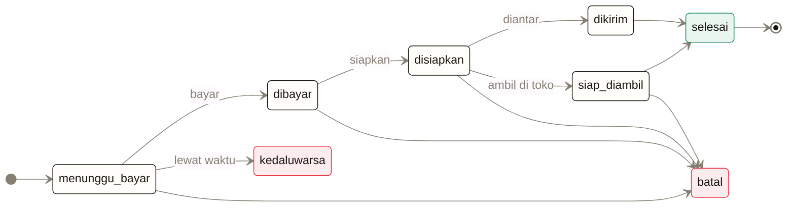

<a name="top"></a>

<div align="center">


<br />


<br /><br />

**Aplikasi kasir buat toko retail kecil sampai menengah.**<br />
Scan barcode, kelola stok dan harga modal, catat pengeluaran,<br />
terus lihat untung-ruginya per periode. Semuanya di satu tempat.

<br />

[**Prinsip**](#prinsip) &nbsp;·&nbsp;
[**Mulai**](#mulai) &nbsp;·&nbsp;
[**Fitur**](#fitur) &nbsp;·&nbsp;
[**QRIS**](#qris) &nbsp;·&nbsp;
[**Struktur**](#struktur) &nbsp;·&nbsp;
[**Data**](#skema) &nbsp;·&nbsp;
[**Testing**](#testing) &nbsp;·&nbsp;
[**Deploy**](#deploy) &nbsp;·&nbsp;
[**Belum ada**](#roadmap)

</div>

<br />

<table>
  <tr>
    <td align="center" width="25%"><h3>0</h3><sub>harga yang dipercaya<br />dari browser</sub></td>
    <td align="center" width="25%"><h3>12 → 10</h3><sub>checkout barengan,<br />stok tetap nggak minus</sub></td>
    <td align="center" width="25%"><h3>3 mode</h3><sub>QRIS, dan nggak ada<br />yang pakai QR bohongan</sub></td>
    <td align="center" width="25%"><h3>2 pintu</h3><sub>kasir &amp; etalase online,<br />stoknya tetap satu</sub></td>
  </tr>
</table>


<a name="prinsip"></a>

## 01 &nbsp;·&nbsp; Kenapa browser nggak dipercaya

Ini keputusan paling penting di proyek ini, dan hampir semua kode di bawah ngikutin aturan ini.

> [!IMPORTANT]
> Harga, total, diskon, dan stok **nggak pernah** diambil dari data kiriman browser.
> Browser cuma boleh ngirim `productId` sama `qty`.



Jadi kasir cuma ngirim daftar barang. Sisanya dikerjain **server**: ambil harga dari Firestore, hitung
ulang total, cek stok, lalu potong stok. Semua itu jalan di dalam satu Firestore transaction. Di sisi
lain, Security Rules nolak semua tulisan langsung dari browser ke `products`, `transactions`,
`expenses`, dan `auditLogs`.

Efeknya di lapangan:

- Kasir iseng buka DevTools terus ganti harga di layar? Pembeli **tetap ditagih harga aslinya**.
- Dua kasir checkout barang terakhir di detik yang sama? **Stok tetap nggak bisa minus**.

<div align="right"><sub><a href="#top">↑ balik ke atas</a></sub></div>


<a name="mulai"></a>

## 02 &nbsp;·&nbsp; Cara jalanin

```bash
npm install
npm run dev
```

Satu server, dua pintu:

| Alamat | Buat siapa |
|:--|:--|
| `http://localhost:3000/` | **Kasir &amp; admin toko**, harus login staf |
| `http://localhost:3000/toko.html` | **Pembeli**, etalase publik yang bisa dibuka tanpa akun |

Dua-duanya pakai stok yang sama. Barang yang baru di-restock admin langsung nongol di etalase, dan
barang yang dipesan pembeli langsung hilang dari daftar jual kasir.

<table>
  <tr>
    <td width="50%" valign="top">
      <h3>Mode Demo</h3>
      <sub>NGGAK PERLU FIREBASE</sub>
      <p>Klik <b>"Demo tanpa login"</b>. Aplikasinya jalan penuh pakai data di <code>localStorage</code>
      browser. Cocok buat nyobain alur kasir, scan barcode, dan laporan tanpa setup apa-apa.</p>
      <p>Aturan validasinya <b>sama persis</b> dengan server (harga diambil dari data tersimpan, stok
      dicek dulu sebelum dipotong), jadi hasilnya nggak nipu. Datanya pakai prefiks
      <code>kasirone_demo_</code> dan nggak bakal kecampur sama data Firestore.</p>
    </td>
    <td width="50%" valign="top">
      <h3>Mode Produksi</h3>
      <sub>FIREBASE AUTH + CLOUD FIRESTORE</sub>
      <p>Login staf beneran, data disimpan di Firestore, role dibaca dari custom claim, dan tiap
      penulisan wajib lewat server plus Security Rules.</p>
      <p>Setup-nya sekali aja, kurang lebih delapan langkah. Panduannya ada di bawah.</p>
    </td>
  </tr>
</table>

<details>
<summary><b>Langkah setup Mode Produksi</b></summary>

<br />

1. Bikin project di [Firebase Console](https://console.firebase.google.com).
2. Daftarin Web App, terus salin konfigurasinya ke `public/firebase-config.js`.
3. Nyalain **Authentication → Email/Password**.
4. Bikin **Cloud Firestore**.
5. Deploy security rules: `npx firebase deploy --only firestore:rules`
6. Download service account (*Project Settings → Service accounts*), simpan jadi
   `serviceAccountKey.json` di root project.
7. Salin `.env.example` jadi `.env`.
8. Bikin akun kasir lewat Firebase Authentication, lalu bikin dokumen `users/{UID}`:

   ```json
   { "role": "cashier", "displayName": "Nabila" }
   ```

   Atau biar gampang, pakai skrip bawaan yang sekalian masang custom claim:

   ```bash
   node scripts/set-role.js kasir@toko.com cashier "Nabila"
   node scripts/set-role.js bos@toko.com  admin    "Admin Toko"
   ```

> [!TIP]
> Habis ganti role, user-nya harus **logout terus login lagi** biar token barunya kepakai.
> Ini penyebab paling sering error 403 yang tiba-tiba muncul.

> [!CAUTION]
> `serviceAccountKey.json` **jangan sampai** masuk Git. Tenang, udah ada di `.gitignore`.
> Kalau Firebase Web API key di `firebase-config.js` sih bukan rahasia, aman ditaruh di frontend.

</details>

### Role

| Role | Bisa ngapain aja |
|:--|:--|
| `cashier` | Transaksi, scan barcode, lihat produk &amp; riwayat transaksi |
| `admin` | Semua yang di atas, **plus** kelola produk, restock, pengeluaran, dan laporan laba |

Role dibaca dari custom claim di ID token. Kalau belum ada, sistem ngecek dokumen `users/{uid}`
sebagai cadangan, jadi akun lama tetap bisa masuk.

<div align="right"><sub><a href="#top">↑ balik ke atas</a></sub></div>


<a name="fitur"></a>

## 03 &nbsp;·&nbsp; Fiturnya apa aja



<details>
<summary><b>Lihat semua fitur</b></summary>

<br />

| Fitur | Penjelasan singkat |
|:--|:--|
| **Scan barcode** | Scanner USB langsung jalan tanpa driver (mode *keyboard wedge*: ngetik cepat lalu Enter). Kalau barcode-nya belum terdaftar, bakal ada notifikasi, jadi nggak diam-diam gagal. |
| **Transaksi atomik** | Stok dan transaksi kesimpan bareng. Kalau satu gagal, dua-duanya batal. Udah dites pakai 12 checkout barengan. |
| **Pembayaran** | Tunai (plus kembalian), Kartu (kode approval EDC), dan QRIS. Soal QRIS ada [penjelasannya sendiri](#qris). |
| **Diskon per transaksi** | Dipotong dulu sebelum pajak. |
| **Foto produk asli** | Tinggal klik atau seret. Ukurannya otomatis dikecilin di browser sebelum disimpan. |
| **Ekspor CSV** | Buat riwayat transaksi dan laporan. |
| **Harga modal &amp; margin** | Diisi per produk, jadi untungnya bisa dihitung. |
| **Stok minimum per produk** | Batas "stok menipis" diatur per barang, nggak disamaratakan. |
| **Restock sekali klik** | Nambah stok sekalian nyatet pengeluarannya. |
| **Laporan periodik** | Pemasukan, pengeluaran, laba kotor &amp; bersih, rincian metode bayar, sampai jumlah terjual per produk (misalnya *Kopi Aren 40 pcs, Indomie Goreng 23 pcs*). |
| **Riwayat transaksi** | Bisa difilter per tanggal, struknya bisa dicetak. |
| **Etalase publik** | `/toko.html`: katalog, keranjang, pilih ambil di toko atau diantar, plus riwayat pesanan pembeli. |
| **Pesanan online** | Status pesanannya lengkap. Stok dikunci pas pesan, dilepas kalau batal, dipotong pas selesai. |
| **Panel pesanan buat staf** | Filter status, lihat detail, pindahin ke tahap berikutnya. |
| **Webhook pembayaran** | Pakai tanda tangan, jadi status bayar nggak bergantung sama browser pembeli yang bisa aja udah ditutup. |

</details>

<a name="qris"></a>

### Soal QRIS

Versi lama sempat nampilin pola kotak-kotak sebagai "QR demo". Ternyata itu bahaya, karena kasir bisa
ngira pembayarannya beneran lagi jalan. Sekarang ada tiga mode, dan halaman **Pengaturan** selalu
nunjukin mode mana yang lagi aktif.

| Mode | Cara nyalain | Uangnya beneran masuk? | Sistem bisa mastiin lunas? |
|:--|:--|:--:|:--|
| **Terverifikasi** | isi `MIDTRANS_SERVER_KEY` | Ya | **Ya**, statusnya dicek ke gateway |
| **Manual** | isi `MERCHANT_QRIS_PAYLOAD` | Ya | Nggak, kasir harus cek mutasi sendiri |
| **Nonaktif** | dua-duanya dikosongin | – | QRIS langsung ditolak |

- **Terverifikasi:** transaksi baru bisa disimpan setelah gateway bilang lunas.
- **Manual:** nominalnya nggak terkunci, jadi aplikasi ngingetin kasir buat cek mutasi dulu.
- **Nonaktif** (dan mode demo): nggak ada gambar QR yang ditampilin sama sekali.

> [!NOTE]
> Mulai dari sandbox Midtrans dulu (`MIDTRANS_IS_PRODUCTION=false`, kuncinya diawali `SB-Mid-server-`).
> Di layar bakal ada tulisan **"SANDBOX"**, biar nggak ada yang salah pakai buat pembeli beneran.

<div align="right"><sub><a href="#top">↑ balik ke atas</a></sub></div>


<a name="struktur"></a>

## 04 &nbsp;·&nbsp; Isi foldernya

```text
kasir-modern/
├── public/
│   ├── index.html
│   ├── style.css
│   ├── firebase-config.js
│   └── js/
│       ├── main.js              entry point, navigasi & perakitan
│       ├── state.js             state terpusat + langganan perubahan
│       ├── auth.js              login, mode demo, logout
│       ├── format.js            format rupiah/tanggal + escape HTML
│       ├── firebase.js          init Firebase sisi klien (auth aja)
│       ├── shared/              dipakai bareng browser & server
│       │   ├── money.js         computeTotals, kembalian, laba
│       │   └── product.js       batas stok menipis
│       ├── api/
│       │   ├── index.js         milih implementasi
│       │   ├── live.api.js      ke backend beneran
│       │   └── demo.api.js      localStorage, aturannya sama
│       └── ui/                  cart, products, checkout, dashboard,
│                                reports, restock, transactions, barcode
├── server/
│   ├── server.js                cuma wiring, nggak ada logika bisnis
│   ├── lib/                     errors.js, validate.js
│   ├── middleware/              auth.js, errorHandler.js
│   ├── routes/                  products, transactions, expenses, reports
│   └── services/                logika bisnis (bisa dipindah ke Cloud Function)
├── test/                        money, report, demo, payment, emulator, rules
├── docs/API.md                  daftar endpoint
├── firestore.rules
└── firestore.indexes.json
```

> [!IMPORTANT]
> **Folder `shared/` itu penting banget.** Server dan browser pakai file yang sama buat ngitung uang.
> Dulu logika total ditulis dua kali dan sempat beda: total di layar udah dipotong diskon, tapi yang
> ditagih belum.

Daftar endpoint lengkapnya ada di [`docs/API.md`](docs/API.md).

<div align="right"><sub><a href="#top">↑ balik ke atas</a></sub></div>


<a name="skema"></a>

## 05 &nbsp;·&nbsp; Bentuk data di Firestore

<details>
<summary><code>users/{uid}</code></summary>

<br />

`displayName`, `role` (`admin` | `cashier`), `email`, `createdAt`

</details>

<details open>
<summary><code>products/{id}</code>: stoknya dibagi dua</summary>

<br />

`name`, `sku` (dipakai sebagai barcode, harus unik), `category`, `hargaJual`, `hargaModal`, `stok`,
`stokDipesan`, `stokMinimum`, `imageUrl`, `aktif`, `createdAt`, `updatedAt`

`stok` itu jumlah fisik yang ada di rak. `stokDipesan` itu bagian yang udah "dijanjiin" ke pesanan
online yang belum selesai. Yang boleh dijual, baik oleh kasir maupun etalase, cuma selisihnya:

```text
tersedia = stok − stokDipesan
```

Kalau nggak dipisah begini, barang terakhir bisa dipesan pembeli online di detik yang sama waktu kasir
lagi ngejual barang itu di toko. Ada tiga kejadian yang ngubah angkanya:

| Kejadian | `stok` | `stokDipesan` |
|:--|:--:|:--:|
| Pembeli pesan | – | naik |
| Pesanan batal / kedaluwarsa | – | turun |
| Pesanan selesai | turun | turun |

</details>

<details>
<summary><code>transactions/{id}</code>: harganya di-snapshot</summary>

<br />

`receiptNumber`, `cashierUid`, `cashierName`, `paymentMethod`, `cashReceived`, `change`,
`qrisReference`, `subtotal`, `discount`, `tax`, `total`, `itemCount`, `createdAt`, dan `lines[]`
yang isinya `{productId, name, sku, hargaJual, hargaModal, qty}`.

`lines[]` nyimpen **snapshot** harga jual dan harga modal pas transaksi terjadi. Jadi kalau harga produk
diganti bulan depan, laporan laba bulan ini tetap akurat.

</details>

<details>
<summary><code>expenses/{id}</code></summary>

<br />

`type` (`restock` | `operasional` | `lainnya`), `productId`, `productName`, `qty`, `hargaModal`,
`amount`, `note`, `createdBy`, `createdAt`

</details>

<details open>
<summary><code>orders/{id}</code>: perjalanan sebuah pesanan</summary>

<br />

`orderNumber`, `status`, `customerUid`, `customerName`, `customerPhone`,
`pengiriman{cara,zona,alamat,catatan,ongkir}`, `lines[]`, `subtotal`, `discount`, `tax`, `ongkir`,
`total`, `paymentMethod`, `paymentRef`, `riwayatStatus[]`, `expiresAt`, `createdAt`, `updatedAt`



Perpindahan status di luar diagram ini bakal ditolak sama tabel `TRANSISI` di
`server/services/order.service.js`. Jadi pesanan nggak bisa ditandai selesai kalau belum pernah dibayar.

</details>

<details>
<summary><code>auditLogs/{id}</code></summary>

<br />

`uid`, `email`, `action`, `metadata`, `createdAt`. Cuma admin yang bisa baca, dan nggak ada satu pun
yang bisa ngubah atau ngehapus.

</details>

<div align="right"><sub><a href="#top">↑ balik ke atas</a></sub></div>


<a name="testing"></a>

## 06 &nbsp;·&nbsp; Testing



```bash
npm test              # unit test biasa, nggak butuh apa-apa
npm run test:emulator # transaksi atomik + race condition (butuh Java)
npm run test:rules    # Security Rules (butuh Java)
npm run test:all
```

**Yang dites khusus:**

- [x] Diskon dipotong sebelum pajak, dan total nggak pernah negatif.
- [x] Harga kiriman browser diabaikan, server tetap pakai harga dari database.
- [x] 12 checkout barengan dengan stok 10: tepat 10 yang berhasil, stok akhirnya 0.
- [x] Transaksi dua produk yang salah satunya stoknya kurang: **seluruhnya** dibatalin.
- [x] Kasir nggak bisa nulis ke `products` / `transactions` langsung dari browser.
- [x] Kasir nggak bisa naikin `role` dirinya sendiri jadi `admin`.
- [x] Kasir nggak bisa jual barang yang udah dikunci pesanan online, tapi sisanya tetap boleh dijual.
- [x] Satu kasir dan delapan pesanan online rebutan stok 5: tepat 5 unit yang kepakai, nggak ada yang dijanjiin dobel.
- [x] Batalin pesanan dua kali nggak bikin `stokDipesan` jadi negatif.
- [x] QRIS yang belum dikonfigurasi **nolak** bikin pembayaran, bukannya nampilin QR palsu.
- [x] QRIS statis ngasilin QR beneran, tapi nggak ngaku-ngaku terverifikasi.

> [!NOTE]
> Emulator Firebase butuh Java. `firebase-tools` v15 ke atas minta JDK 21+, makanya project ini pakai
> `firebase-tools` v13 secara lokal biar tetap jalan di JDK 17.

<div align="right"><sub><a href="#top">↑ balik ke atas</a></sub></div>


<a name="deploy"></a>

## 07 &nbsp;·&nbsp; Mau deploy?

Isi `.env` minimal kayak gini (daftar lengkap plus penjelasannya ada di [`.env.example`](.env.example)):

```env
PORT=3000
NODE_ENV=production
CLIENT_ORIGIN=https://domain-anda.com
GOOGLE_APPLICATION_CREDENTIALS=./serviceAccountKey.json
```

**Cek dulu sebelum rilis pertama:**

- [ ] `git log --all -- serviceAccountKey.json` harus kosong
- [ ] Security Rules udah dideploy dan dites di emulator
- [ ] `CLIENT_ORIGIN` udah diganti ke domain produksi (kalau nggak, bakal kena CORS)
- [ ] Firebase App Check udah dinyalain
- [ ] Indeks komposit udah dibikin: `npx firebase deploy --only firestore:indexes`

Logika bisnisnya sengaja ditaruh di `server/services/` dan nggak nempel ke Express. Jadi kalau nanti
mau pindah ke Cloud Functions, isinya nggak perlu diubah, cukup ganti bagian yang manggilnya.

<div align="right"><sub><a href="#top">↑ balik ke atas</a></sub></div>


<a name="roadmap"></a>

## 08 &nbsp;·&nbsp; Yang belum dikerjain

| Bagian | Sekarang | Rencananya |
|:--|:--|:--|
| Foto produk | Disimpan sebagai data URL di dalam dokumen produk | Pindah ke Firebase Storage atau CDN kalau katalognya udah gede |
| Scan barcode | Scanner USB dan ketik manual | Scan pakai kamera HP |
| Cetak struk | Print bawaan browser | Printer thermal |
| Skala toko | Satu cabang | Multi-cabang, App Check, dan poin pelanggan |

<br />

<div align="center">
  
  <br />
  <sub><a href="#top">↑ balik ke atas</a></sub>
</div>
